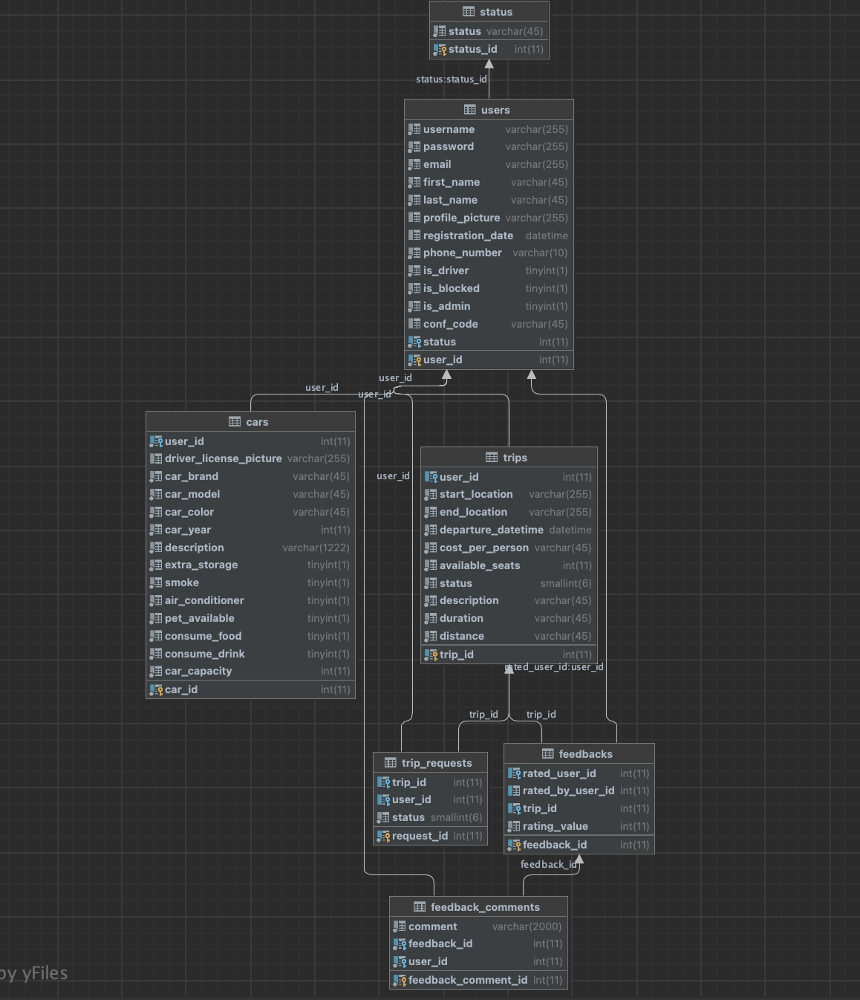

# Carpooling Project Assigment 


## Project Description

The Carpooling project is a web application designed to facilitate carpooling and ride-sharing among users. It allows users to create trips, request rides, and provide feedback on their travel experiences.

- Public part: Accessible without authentication, it provides the register form and a list of the top best rated drivers and passengers 
- Private part: Accessible only for authenticated users; users have the opportunity to create a trip, create a car, join a trip and rate each  
- Administrative part: Accessible to administrators/creators only, as it allows managing (blocking, activating/unactivating and deleting) other users on the platform, as well as implementing certain filtering 
- REST API: Allows other developers to integrate with the application.

## Technologies Used
- Java
- Spring MVC
- Spring Boot RESTful APIs
- Swagger
- Hibernate
- HTML
- CSS
- ThemeForest 
- Mockito 

Teamwork and communication: Git (GitLab) with separate branches, Git Lab Issues and board, MS Teams.
Best programming practices and principles used: OOP, SOLID, and KISS principles, client-side  and server-side data validation, exception handling, unit testing of the "business" functionality, etc.
## Swagger
To explore and interact with the API endpoints, feel free to visit the [Swagger documentation](http://localhost:8080/swagger-ui/#/).


## Local Setup and Installation

1. Clone or download the project on your local machine using  https://gitlab.com/ledkaa/carpooling
2. Navigate to the project directory: ```bash cd carpooling```

3. Ensure you have Java Development Kit (JDK)

4. Install the required dependencies 

5. Set up the database:

Locate the SQL scripts in the carpooling/database directory

Execute the SQL scripts on your database using your preferred database client or command-line tool:

- Execute the "create.sql" script to create the database structure

- Execute the "insert.sql" script to populate the database with the initial data

6. Run the application

7. Access the application in your browser at http://localhost:8080
## Database Relations

